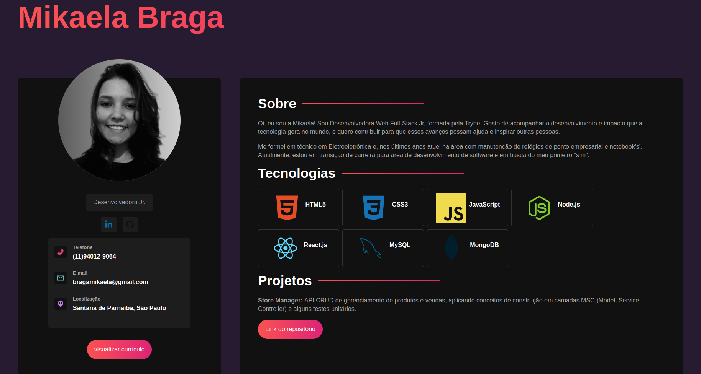

# Simples "About me"

Simples página com informações sobre mim, feita em `React.js` para iniciar o aprendizado de `Sass`.

---
### Alguns conceitos aplicados

- Declarações de variáveis de estilos (`@variables`) para reutilização
- Declarações de conjuntos de estilos  (`@mixins`) para reutilização

---

### View da página

---

### Refêrencias

Esses conceitos foram aplicados com auxílio de um tutorial no youtube

[Vídeo Tutorial - Canal Hora de Codar](https://www.youtube.com/watch?v=5h4vMtBlQQU&t=3505s&ab_channel=MatheusBattisti-HoradeCodar)

---
